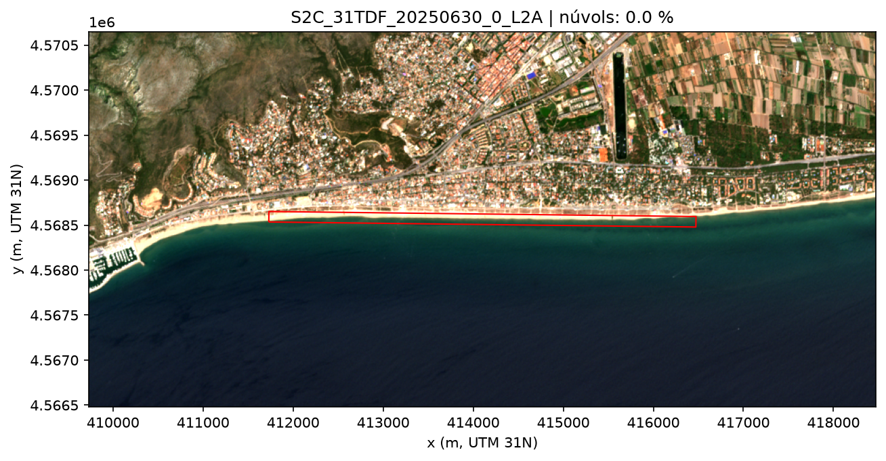
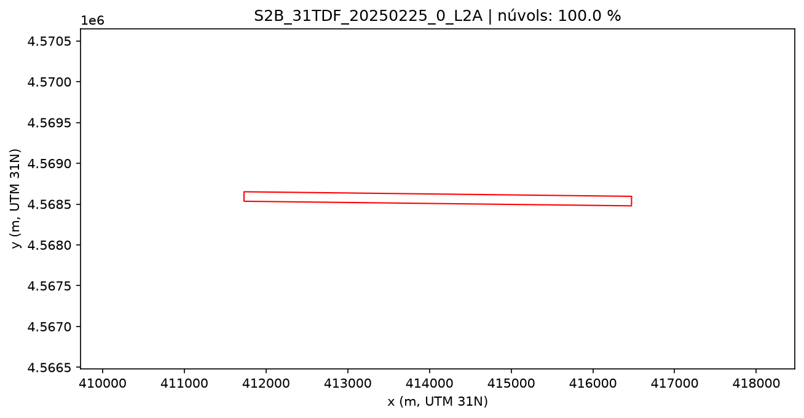
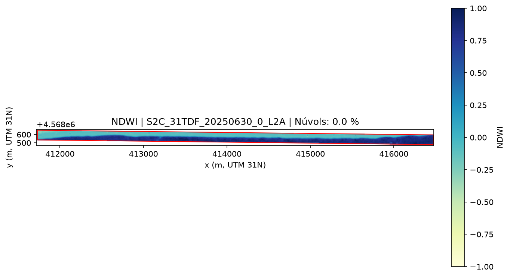
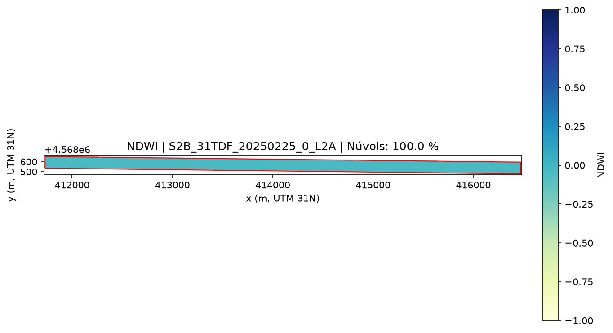
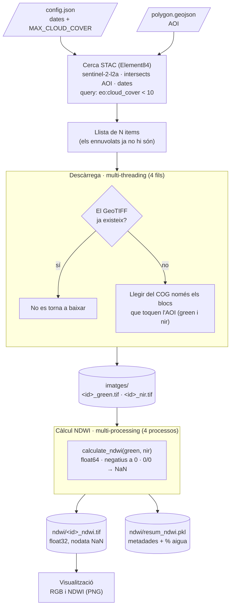

# Tasca 2

## 1. Expected output

### Number of images available, for every satellite (A/B/C). Does it match what is expected?

Període 2025-01-01 → 2025-07-01 (181 dies), tile 31TDF, catàleg Element84.

| Satèl·lit | Imatges |
|---|---|
| Sentinel-2A | 26 |
| Sentinel-2B | 36 |
| Sentinel-2C | 33 |
| **Total** | **95** |

**Sí, quadra.** Cada satèl·lit Sentinel-2 repeteix òrbita cada 10 dies. A la nostra latitud les franges de captura se solapen i el tile queda cobert per dues òrbites diferents, així que cada satèl·lit dona unes 2 imatges cada 10 dies:

$$\frac{181\ \text{dies}}{10\ \text{dies}} \times 2 \approx 36\ \text{imatges per satèl·lit}$$

- **2B** opera normalment tot el semestre i dona exactament les 36 esperades.
- **2C** substitueix 2A a la constel·lació el 21 de gener (la darrera imatge de 2A en òrbita normal és del 14 de gener).
- **2A** no dona cap imatge al febrer i torna el 17 de març en una campanya estesa, com a tercer satèl·lit.

Per això de març a juny hi ha tres satèl·lits actius i el total (95) supera les ~72 d'una constel·lació de dos.

Una de les dues òrbites només passa per la vora del tile: en 47 de les 95 imatges el tile té un 91-94 % de píxels sense dades, i part del polígon (entre un 26 % i un 93 %) queda fora de la franja fotografiada. Les altres 48 imatges cobreixen el polígon sencer.

### GeoTIFF files for the green and nir bands, for every image. What is the file size? Extrapolate what will be the size in disk of all the images, for N months

Només es descarrega el tros de cada banda que cau dins del polígon. Els fitxers són COG (*Cloud Optimized GeoTIFF*), i `rasterio` pot llegir-ne només els blocs que toquen l'AOI.

| | Tile sencer | Retall de l'AOI |
|---|---|---|
| Píxels | 10 980 × 10 980 | 476 × 19 |
| Per banda | ~170-194 MB | ~18 KB |
| Per imatge (green + nir) | ~364 MB | ~36 KB |
| 95 imatges | ~34,6 GB | 3,35 MB |

La mida del retall és 476 × 19 píxels × 2 bytes (`uint16`) ≈ 18 KB.

**Extrapolació** (≈ 16 imatges/mes):

$$\text{mida}(N) \approx 0{,}56\ \text{MB/mes} \times N$$

| Mesos | Retall | Tile sencer |
|---|---|---|
| 1 | 0,56 MB | ~5,8 GB |
| 12 | 6,8 MB | ~70 GB |
| 24 | 13,5 MB | ~140 GB |

Suposa el mateix nombre d'imatges cada mes. Amb només dos satèl·lits actius seria una mica menys.

### Program execution time. Calculate total size of the files downloaded, and bandwidth at the time of the download. Extrapolate execution time for N months

El temps es mesura amb `time.perf_counter()` i els bytes rebuts per la xarxa amb `psutil.net_io_counters()`.

| Mesura | Valor |
|---|---|
| Temps total del programa | 920 s ≈ 15,3 min |
| Temps de descàrrega | 913 s (9,6 s per imatge) |
| Desat a disc | 3,35 MB |
| Baixat per la xarxa | 447 MB |
| Amplada de banda | 0,49 MB/s = 3,9 Mbit/s |

**Per xarxa es baixa molt més del que es desa** perquè cada bloc del COG (1024 × 1024 píxels) està comprimit sencer: per llegir les 19 files de l'AOI cal baixar el bloc complet (~2,35 MB per fitxer). Tot i així, és unes 77 vegades menys que baixar els tiles sencers.

**L'amplada de banda és baixa per la latència, no per la connexió.** Les dades són a AWS Oregon (~150-200 ms per petició), cada fitxer necessita diverses peticions seguides i els fitxers es baixen un darrere l'altre. El programa només va fer servir ~8 s de CPU en 15 min: la resta del temps va estar esperant la xarxa. Baixar diversos fitxers en paral·lel reduiria molt el temps.

**Extrapolació del temps** (≈ 2,6 min/mes):

| Mesos | Temps |
|---|---|
| 1 | 2,6 min |
| 12 | 31 min |
| 24 | 1 h |

### RGB visualization



Es fa servir l'asset `visual` (TCI, *True Color Image*): una imatge ja composta per l'ESA amb les bandes red (B04), green (B03) i blue (B02), en 8 bits (0-255), a 10 m. Així n'hi ha prou amb una sola descàrrega en lloc de tres bandes.

L'AOI només fa 19 píxels d'alt, així que es mostra amb 2 km de marge al voltant i el polígon dibuixat en vermell. El polígon cobreix la línia de costa de Castelldefels: la franja de sorra i l'aigua just al costat.

## 2. Taking into account cloud cover

Filtre: `MAX_CLOUD_COVER_PERCENTAGE = 10` (a `config.json`), aplicat sobre la propietat `eo:cloud_cover` de cada imatge.

### Decision of at which stage cloudy images should be filtered out

**A la cerca al catàleg**, abans de descarregar res. Es demana al servidor només les imatges que compleixen el filtre:

```python
search = client.search(..., query={"eo:cloud_cover": {"lt": 10}})
```

Hi havia tres opcions:

1. **A la cerca (escollida).** El servidor ja retorna només les imatges bones, així que les altres no es descarreguen mai.
2. **Després de cercar i abans de descarregar**, mirant `eo:cloud_cover` de cada item a Python. El resultat és el mateix, però es reben del servidor les metadades de totes les imatges.
3. **Després de descarregar**, mirant els píxels. Seria el més precís per al polígon, però obliga a baixar totes les imatges per acabar-ne llençant la majoria.

Com s'ha vist a la 1c, el que costa temps és el nombre de peticions (latència), no els MB. Filtrar a la cerca redueix les descàrregues de 190 fitxers a 48.

Limitació: `eo:cloud_cover` és el % de núvols de **tot el tile** (110 × 110 km), no del polígon. Una imatge pot tenir núvols lluny de la costa i quedar descartada, o al revés.

### Number of images available, for every satellite, should be less than without filtering, validate

| Satèl·lit | Sense filtre | Núvols < 10 % |
|---|---|---|
| Sentinel-2A | 26 | 6 |
| Sentinel-2B | 36 | 9 |
| Sentinel-2C | 33 | 9 |
| **Total** | **95** | **24** |

El programa ho valida sol: per cada satèl·lit comprova que el nombre amb filtre sigui menor o igual que sense filtre. Queden un 25 % de les imatges, cosa raonable per a un hivern i una primavera.

### RGB visualization of the cloudless and the cloudy scenes

Es mostra la imatge amb menys núvols i la que en té més, entre les que cobreixen el polígon sencer.


**30-06-2025, 0 % de núvols** (passa el filtre): es veu clarament la costa, la ciutat i el mar.



**25-02-2025, 100 % de núvols** (descartada pel filtre): tota la imatge és blanca, no es veu el terra.

El filtre funciona com s'esperava: la imatge que passa és neta i la descartada és inservible per calcular el NDWI.

## 3. Compute NDWI for all

$$NDWI = \frac{Green - NIR}{Green + NIR}$$

L'aigua reflecteix una mica de verd i absorbeix gairebé tot l'infraroig proper, així que dona valors positius. La vegetació i el sòl reflecteixen molt infraroig i donen valors negatius.

La funció és a `ndwi.py` i el test a `test_ndwi.py`. Els tests s'executen amb:

```bash
python -m pytest Tasca2
```

### Take the unittest that you wrote for previous week's homework, and tune your calculate_ndwi() function until you make it pass

El test (`test_ndwi.py`, amb `pytest` i `@pytest.mark.parametrize`) comprova:

| Test | Què comprova |
|---|---|
| Valors bàsics (×5) | Aigua (0,6), vegetació (-0,78), valors iguals (0) i els extrems +1 i -1 |
| Matriu 2D | Que funcioni amb una imatge sencera i mantingui la forma |
| Divisió per zero | Els píxels amb green = nir = 0 donen NaN |
| Entrada `uint16` | Que doni el resultat correcte amb el tipus de dada dels GeoTIFF |
| Rang [-1, 1] | Que el resultat no en surti mai, encara que hi hagi reflectàncies negatives |
| Formes diferents (×2) | Que green i nir de mides diferents donin `ValueError` |

**Versió 1**, la fórmula tal qual: `(green - nir) / (green + nir)`. Van fallar 2 dels 10 tests:

- **`uint16`**: va donar 15,884 en lloc de -0,5. Un `uint16` no pot ser negatiu, així que 1000 - 3000 "dona la volta" i surt 63536. És un error silenciós: tots els píxels amb nir > green (vegetació, terra) sortirien malament.
- **Rang**: va donar 3. Amb green = 0,02 i nir = -0,01, (0,03) / (0,01) = 3, que no té sentit físic.
- La divisió per zero passava, però per casualitat: numpy fa 0/0 = NaN i llança un `RuntimeWarning`.

**Versió final**, amb tres canvis:

1. Convertir les entrades a `float64` abans d'operar (`np.asarray(..., dtype=np.float64)`).
2. Posar les reflectàncies negatives a 0 (`np.maximum(x, 0)`).
3. Dividir només on el denominador és més gran que 0 (`np.divide(..., where=denominador > 0)`) i deixar la resta a NaN.

A més, es comprova explícitament que green i nir tinguin la mateixa forma. Sense aquesta comprovació, una matriu (2, 2) i una (1, 2) no donarien error, perquè numpy "estira" la petita (*broadcasting*) i calcularia un resultat sense sentit. S'hi va afegir un test per a aquest cas.

Resultat: **11 de 11 tests passen**, sense cap avís.

### Decide if implementing calculation "pixel-wise" or leveraging Numpy's matrix operators

**Operadors de matriu de numpy.** S'ha comparat la funció amb una versió que recorre els píxels un a un amb dos bucles `for`, sobre una matriu de 1000 × 1000:

| Implementació | Temps (1000 × 1000) | Tile sencer (10 980 × 10 980, estimat) |
|---|---|---|
| Píxel a píxel (`for`) | 0,33 s | ~1 min |
| Numpy | 0,008 s | ~1 s |

Les dues donen el mateix resultat, però numpy és unes 40 vegades més ràpid. Numpy fa el bucle internament en C, sobre dades contigües a memòria, i s'estalvia el cost de Python per a cada píxel. A més, el codi és més curt i s'assembla directament a la fórmula.

### What corner cases must be taken into account? How are they managed?

| Cas límit | Per què passa | Com es gestiona |
|---|---|---|
| **Dades `uint16`** | Els GeoTIFF guarden enters sense signe; les restes negatives "donen la volta" | Conversió a `float64` abans d'operar |
| **Divisió 0/0** | Píxels sense dades (`nodata = 0`). En 47 de les 95 imatges, part del polígon queda fora de la franja del satèl·lit | `np.divide(..., where=denominador > 0)`: el resultat queda **NaN**, que vol dir "sense dada", i no un número inventat |
| **Reflectàncies negatives** | Amb les imatges d'Element84 no passa: tot i que les metadades indiquen `offset: -0.1`, els valors ja el porten tret (al mar, nir ≈ 54, que amb l'offset donaria una reflectància negativa impossible) i la reflectància és valor × 0,0001. Però si la funció rep valors negatius (una altra font de dades, soroll), el NDWI sortiria fora de [-1, 1] | Es posen a 0 amb `np.maximum` |
| **Formes diferents** | Si green i nir no són la mateixa imatge, numpy pot combinar-les igualment (*broadcasting*) | Es llança `ValueError` |
| **Núvols** | Un píxel de núvol no és ni aigua ni terra i dona un NDWI enganyós | Filtre `eo:cloud_cover < 10` de la part 2 |

### Visualize the NDWI index, choose an appropriate color coding. Can open water be detected at plain sight?





**Codificació de colors.** S'usa l'escala `YlGnBu` (groc → verd → blau), fixada entre -1 i 1 (`vmin=-1, vmax=1`) perquè totes les imatges siguin comparables. Els valors alts (aigua) surten en blau fosc, que és el color que s'associa intuïtivament a l'aigua. Una escala divergent com `RdBu`, centrada en 0, també seria adequada, perquè el NDWI té un punt neutre a 0 que separa l'aigua (> 0) de la terra (< 0).

**Sí, l'aigua es detecta a simple vista.** A la imatge neta (30-06-2025) la franja es divideix clarament en dues parts:

| Zona | green | nir | NDWI |
|---|---|---|---|
| Mar (part de baix) | ~766 | ~54 | ~0,87 |
| Sorra (part de dalt) | ~2758 | ~3348 | ~-0,10 |

L'aigua absorbeix gairebé tot l'infraroig i dona un NDWI molt alt. La sorra reflecteix una mica més d'infraroig que de verd i queda lleugerament negativa. La frontera entre els dos colors és la línia de costa.

A la imatge ennuvolada (25-02-2025) tota la franja surt d'un color uniforme a prop de 0: els núvols reflecteixen el verd i l'infraroig gairebé igual, així que no se'n pot treure res. És una altra confirmació que el filtre de núvols de la part 2 és necessari.

### Store the result as a GeoTIFF file. Store other variables, if needed, as pickle files

**GeoTIFF.** Per a cadascuna de les 24 imatges filtrades es desa `ndwi/<id>_ndwi.tif`. Es copia la fitxa tècnica (*profile*) de la banda green, perquè el NDWI tingui exactament la mateixa mida, CRS (EPSG:32631) i posició al mapa, i es canvien dues coses:

- **`float32`** en lloc de `uint16`: el NDWI té decimals entre -1 i 1. `float32` ocupa la meitat que `float64` i té precisió de sobra per a aquest rang.
- **`nodata = NaN`** en lloc de 0: un NDWI de 0 és un valor vàlid (ni aigua ni terra), així que no pot voler dir "sense dades".

Cada fitxer ocupa ~36 KB (476 × 19 píxels × 4 bytes), 857 KB en total.

**Pickle.** El GeoTIFF només pot guardar matrius de números. La resta d'informació de cada imatge, que s'ha de poder recuperar sense tornar a consultar el catàleg, es desa a `ndwi/resum_ndwi.pkl`: una llista de diccionaris de Python, un per imatge.

| Camp | Contingut |
|---|---|
| `id` | Identificador de la imatge |
| `data` | Data i hora de captura (`datetime`) |
| `satel·lit` | sentinel-2a / 2b / 2c |
| `nuvols_%` | `eo:cloud_cover` del tile |
| `fitxer_ndwi` | Nom del GeoTIFF corresponent |
| `pixels_valids_%` | % de píxels del retall amb dades |
| `aigua_%` | % de píxels vàlids amb NDWI > 0 |

Es recupera amb:

```python
import pickle
with open("Tasca2/ndwi/resum_ndwi.pkl", "rb") as f:
    resum = pickle.load(f)
```

El resum permet veure ràpidament la qualitat de cada imatge. Per exemple, `pixels_valids_%` és com a màxim 61,2 %, perquè el retall és el rectangle que envolta el polígon inclinat i la resta queda fora. Les imatges que no arriben a aquest valor són les de l'òrbita que només cobreix el polígon en part.

## 4. Arquitectura i paral·lelisme

### Write down a proposed architecture flowchart for the program that retrieves N images via STAC, filters the cloudy ones and computes NDWI for all



El programa té tres etapes, cadascuna amb el tipus de paral·lelisme que li correspon:

1. **Cerca i filtre de núvols.** Una sola petició al catàleg STAC. El filtre de núvols es fa al servidor, així que les imatges ennuvolades mai arriben a la llista i no es descarreguen.
2. **Descàrrega (fils).** És una tasca d'**entrada/sortida**: el programa passa gairebé tot el temps esperant respostes del servidor (a la 1c, ~8 s de CPU en 15 min). Mentre un fil espera, els altres poden fer les seves peticions. Els fils comparteixen memòria i són lleugers de crear.
3. **Càlcul del NDWI (processos).** És una tasca de **càlcul** (CPU). A Python, el GIL només deixa que un fil executi codi Python alhora, així que els fils no ajudarien; cada procés té el seu propi intèrpret i pot fer servir un nucli diferent.

Cada imatge es processa de manera independent (cap imatge necessita el resultat d'una altra), així que totes dues etapes es poden repartir entre fils o processos sense coordinació entre ells.
